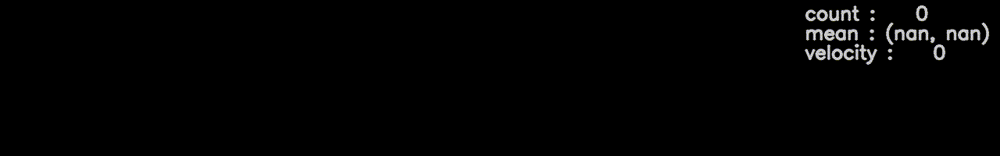

Birdwatcher
===========

|Github CI Status| |Appveyor Status| |PyPi version| |Docs Status| |Repo Status|
|Codecov status|

Birdwatcher is a Python computer vision library for analyzing animal behavior
in a Python scientific computing environment.

Birdwatcher should help you getting up and running quickly when building
analysis code or tools for specific measurements. It provides high-level
functionality that is common in video analysis, such as reading and writing
videos into and from numpy arrays, applying processing algorithms such as
background subtraction, morphological transformation, resizing, drawing on
frames etc. Much of the underlying video and image processing is based on
`FFmpeg <https://www.ffmpeg.org/>`__ and `OpenCV <https://opencv.org/>`__,
but Birdwatcher is a lot easier to use for many tasks because its
higher-level implementation of functionality as compared to these tools.

Despite its name, Birdwatcher is not only for birds. We also successfully
analyzed dog behavior, and it could be used on anything that moves. It is
being used in our lab but still under heavy development, and should be
considered alpha software.

Code can be found on GitHub: https://github.com/gbeckers/Birdwatcher .

Documentation can be found at https://birdwatcher.readthedocs.io .

It is developed by Gabriel Beckers and Carien Mol, at Experimental Psychology,
Utrecht University. It is open source, freely available under the `New BSD License
<https://opensource.org/licenses/BSD-3-Clause>`__ terms.

Installation Birdwatcher package
--------------------------------

Birdwatcher depends on Python 3.6 or higher, and a number of libraries. As
long as there is no official release. It is best to use the github master
branch. The older (alpha) versions on PyPi are outdated.

**User installation**

1) We recommend using Anaconda for installation. Install Anaconda from https://www.anaconda.com/ .

2) Open Anaconda prompt in terminal.

3) Create new environment for Birdwatcher (name is up to you, in example
   here 'mybirdwatcher'). We install Jupter lab and ffmpeg at the same time::

    $ conda create -n mybirdwatcher python=3.8 jupyterlab ffmpeg

4) Switch to this new environment:

   Linux and MacOS::

    $ source activate mybirdwatcher

   Windows::

    $ conda activate mybirdwatcher

5) Install Birdwatcher master branch from git repo::

    $ pip install git+https://github.com/gbeckers/birdwatcher@master

**Dependencies**

The following dependencies are automatically taken care of when you
install Birdwatcher from GitHub using the pip method above:

- numpy
- matplotlib
- darr
- opencv-python
- opencv-contrib-python

It further depends on:

- ffmpeg (including ffprobe)

If you do not use the conda way above to install ffmpeg, you need to
install it yourself (https://www.ffmpeg.org/).

Test
----

To run the test suite:

.. code:: python

    >>>import birdwatcher as bw
    >>>bw.test()
    ..................................
    ----------------------------------------------------------------------
    Ran 33 tests in 12.788s

    OK

    <unittest.runner.TextTestResult run=33 errors=0 failures=0>

Documentation
-------------

https://birdwatcher.readthedocs.io

Examples
--------

See notebook directory.

Contributions
-------------
Sita ter Haar and Dylan Minekus helped exploring the application of movement
detection algorithms.

.. |Repo Status| image:: https://www.repostatus.org/badges/latest/active.svg
   :alt: Project Status: Active – The project has reached a stable, usable state and is being actively developed.
   :target: https://www.repostatus.org/#active
.. |Github CI Status| image:: https://github.com/gbeckers/Birdwatcher/actions/workflows/python_package.yml/badge.svg
   :target: https://github.com/gbeckers/Birdwatcher/actions/workflows/python_package.yml
.. |Appveyor Status| image:: https://ci.appveyor.com/api/projects/status/github/gbeckers/darr?svg=true
   :target: https://ci.appveyor.com/project/gbeckers/birdwatcher
.. |PyPi version| image:: https://img.shields.io/badge/pypi-0.2.0-orange.svg
   :target: https://pypi.org/project/birdwatcher/
.. |Docs Status| image:: https://readthedocs.org/projects/birdwatcher/badge/?version=latest
   :target: https://birdwatcher.readthedocs.io/en/latest/
.. |Codecov status| image:: https://codecov.io/gh/gbeckers/Birdwatcher/branch/master/graph/badge.svg?token=829BH0NSVM
   :target: https://codecov.io/gh/gbeckers/Birdwatcher

